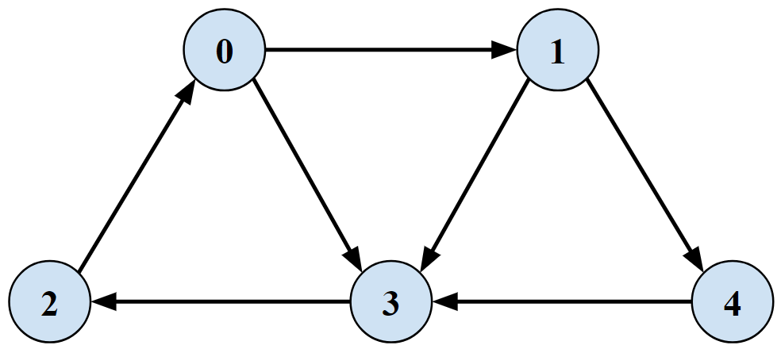
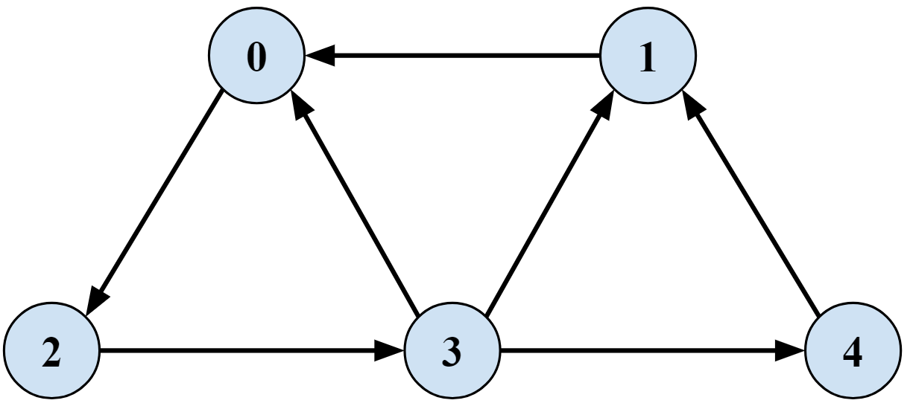
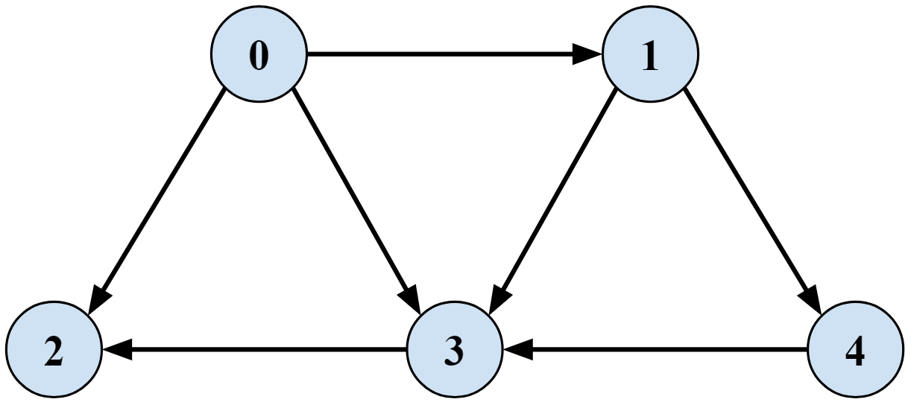
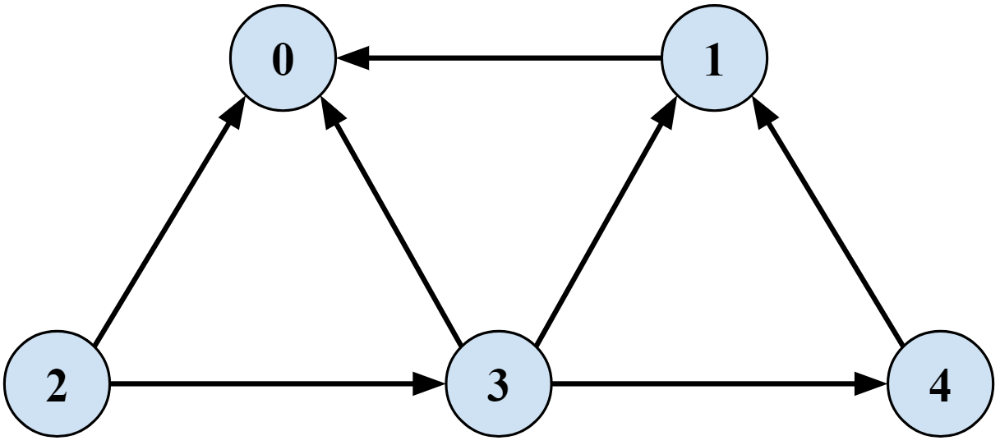

# Strong Connectivity
Application of Breadth-First Search to see if a directed graph is Strongly Connected

## Problem Statement
- Vertex `u` and `v` are **mutually reachable** if there is a path from `u` to `v` and also a path from `v` to `u`
- A directed graph is **strongly connected** if every pair of nodes is mutually reachable

## Algorithm
- Run BFS from any vertex
- Make Grev, a new graph with edge directions reversed
- Run BFS on Grev
- Return true iff every vertex is reachable in both BFS on G and BFS on Grev

## Input Graphs
### Graph 1 (is stronly connected)

### Graph 1 Reversed

  

### Graph 2 (NOT stronly connected)

### Graph 2 Reversed

## Usage
- Make a `new StrongConnectivity()` object
- Create a graph as an `ArrayList<ArrayList<Integer>>` **Adjacency List**  
  - Each `graph.get(u)` is an `ArrayList<Integer>` of vertices representing edges going **From `u`**
  - Vertex names are simply increasing integer values, no need for human-readable vertex ID's like `S` or `T`
  - Graph adjacency list must have all edges represented
  - If there are no outgoing edges from a vertex, add an empty `ArrayList`  
  `graph2.add(new ArrayList<Integer>());`
- Call `isStronglyConnected()` and pass in a graph  
`boolean isGraph1StronglyConnected = strongConnectivityFinder.isStronglyConnected(graph1);`

## Code Notes
- `isStronglyConnected()` always chooses vertex `0` to start BFS, but that's completely arbitrary

## References
- [Strong Connectivity - Richard Zanibbi](https://www.cs.rit.edu/~rlaz/algorithms20082/slides/DAGs.pdf#page=4)
- [Strong Connectivity - Kevin Wayne](https://www.cs.princeton.edu/~wayne/kleinberg-tardos/pdf/03Graphs.pdf#page=41)
- [Strong Connectivity - Jaehyun Park](https://web.stanford.edu/class/cs97si/06-basic-graph-algorithms.pdf#page=36)
